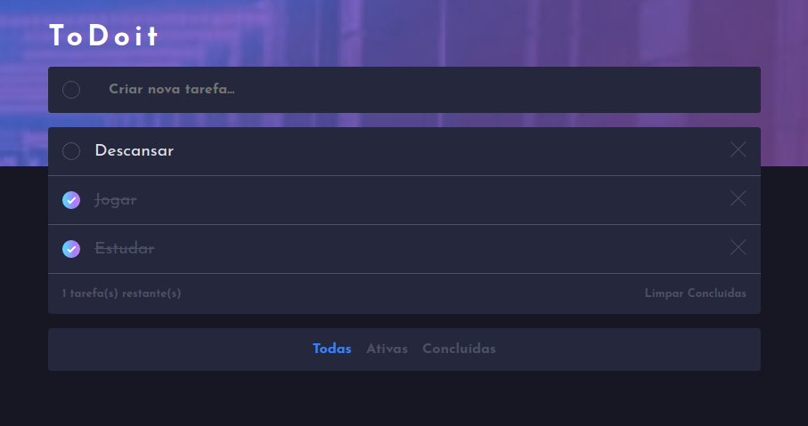

# ToDoit

---

## :bookmark_tabs: Tabela de Conteúdo

- [:closed_book: Sobre](#closed_book-sobre)
- [:hammer_and_pick: Tecnologias Utilizadas](#hammer_and_pick-tecnologias-utilizadas)
- [:sparkles: Features](#sparkles-features)
- [:student: O Que Aprendi](#student-o-que-aprendi)
- [:handshake: Seja um Contribuidor](#handshake-seja-um-contribuidor)

---

## :closed_book: Sobre

Este projeto foi realizado como um dos desafios do Frontend Mentor. Seu objetivo
é ser uma lista de tarefas simples e intuitiva.

---

## :hammer_and_pick: Tecnologias Utilizadas

Para desenvolver esta aplicação, utilizei as seguintes tecnologias:

- HTML5
- SCSS (Convertido para CSS3)
- Javascript (Vanilla)
- Webpack + Babel

---

## :sparkles: Features

- CRUD de tarefas
- Salvamento de dados no localStorage
- Opção de filtrar tarefas entre concluídas, ativas ou todas

---

## :student: O Que Aprendi

Ainda que simples, foi um projeto muito produtivo. Em grande parte, por ter sido
minha primeira experiência prática - sem tutoriais - de um projeto utilizando
Webpack e Babel.

Pude experimentar uma ferramenta que "traduz" o código mais moderno de JS para
uma versão que navegadores mais antigos possam entender, o Babel. Lógicamente,
o processo de aprendizado trouxe consigo diversos bugs, mas resolvê-los e 
descobrir novos conceitos - ou relembrar alguns que já havia esquecido, como 
polyfill - foi divertido. Neste projeto, Babel não precisou de tantas configu-
rações, veio pronto para usar direto da caixa, por assim dizer. Foi bem mais
simples do que experimentar async/await, por exemplo.

Conjunto ao Babel, também pude colocar em prática um pouco do Webpack, que
serviu como um empacotador dos meus módulos JS e folhas de estilo, unificando
tudo e aproveitando-se do Babel para garantir que funcionaria em navegadores
mais antigos.

Webpack foi a ferramenta que mais deu trabalho durante o desenvolvimento.
Encontrar os plugins corretos para resolver os bugs de urls em arquivos SCSS
levou um tempo e foi um pouco cansativo, mas o processo de aprendizado foi sem
dúvidas incrível, e me deixou ainda mais animado para experimentar estas
ferramentas em processos futuros.

No mais, foi uma ótima experiência, e um aprendizado muito produtivo, além de
divertido. Como disse anteriormente, só me deixou mais animado para continuar
aprendendo e colocando em prática os conhecimentos.

## :handshake: Seja um contribuidor

Tem alguma ideia que poderia alavancar ainda mais o projeto, e deseja implementar? É simples!

1. Faça fork do proketo
2. Modifique o que achar necessário
3. Faça o commit das mudanças
4. Crie um Pull Request
